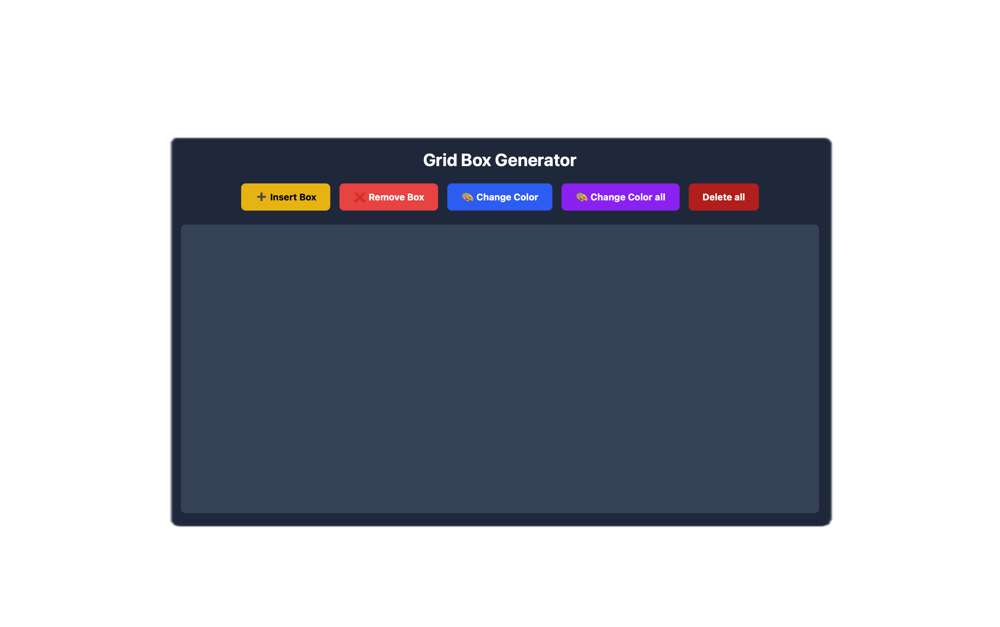
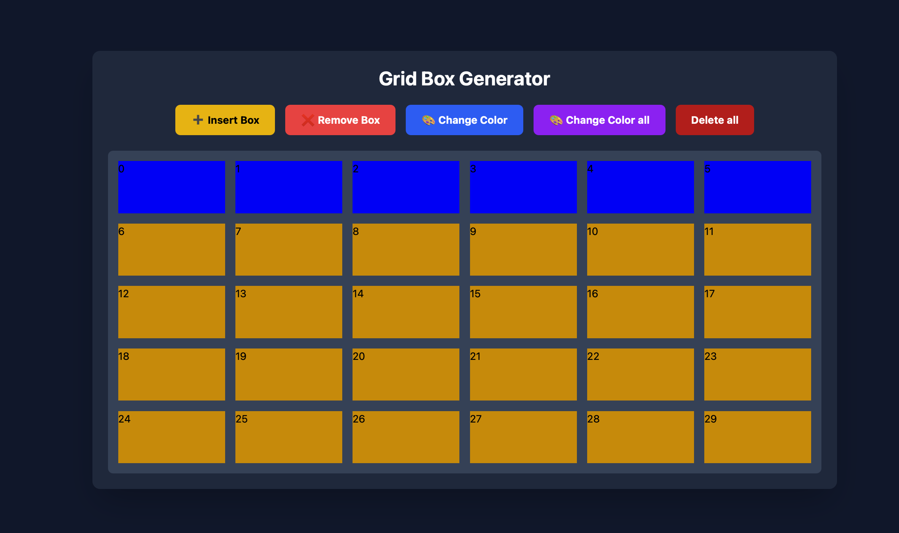

# 🚀 JavaScript Challenge

Welcome to my **JavaScript Challenge**!  
This repository tracks my daily progress as I improve my JavaScript skills by building projects, solving problems, and practicing core concepts.

## 🌐 Live Project

<div align="center">

<a href="https://mymap.icu/1D5JZV" target="_blank">
  
</a>

<br><br>

✨ **Experience the project live:**  
🌐 **Live Website:** [Visit My Website](https://mymap.icu/1D5JZV)

<br>

📅 **Domain Status:** Active  
⏳ **Domain Expiry:** `April 12, 2027`

</div>
<!-- Original URL: https://flex-game-omega.vercel.app -->


## 📌 Concepts Used

- DOM Selection
- `createElement()`
- `appendChild()`
- `children`
- `classList`
- `addEventListener()`
- Dynamic Styling
- UI Updates


## 📂 Folder Structure

```
📁 Javascript/
│── index.html
│── style.css
│── script.js
│── README.md
```


---

## 🖼️ Project Preview

<div align="center">

<table>
<tr>
<td align="center">



<br>

<b>Preview 1</b>

<br><br>

<a href="./Images/preview1.png" target="_blank">

</a>

</td>

<td align="center">



<br>

<b>Preview 2</b>

<br><br>

<a href="./Images/preview2.png" target="_blank">

</a>

</td>
</tr>
</table>

</div>

---

---

## 📌 Project Details

| Details | Information |
|---------|-------------|
| 📅 Project Built Date | July 15, 2026 |
| ⏰ Project Built Time | 02:00 PM - 04:00 PM |
| 🚀 Uploaded to GitHub Date | July 15, 2026 |
| ⏰ Uploaded to GitHub Time | 03:00 PM |
| ⏳ Total Development Time | 2 Hours |

---

<div align="center">

❤️ Made with Love by **Renjiro Robin** 🚀

</div>

